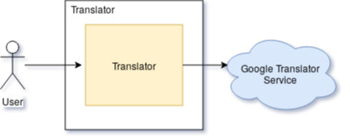

# Developer Guide

## Introduction
This programm is a translator of text and words in every language the user want, to the a selected language. This programm is to help people to translate faster and esier than searching in the dictionary itself.

## Features
### Joe Acuña
- v1.0: Receive the input text and search if it is in the database.

### Rodrigo Bedoya
- v1.0: Match English words to the translated word in Spanish.

### Nicolás Chipana
- v1.0: Display the text translated.

### Bryan Díaz and Juan Manuel Navarro
- v1.0: Make the test and code quality.

### Reynaldo Rojas
- v1.0: Coming soon...

## Design

### Architecture

#### Component Diagram

#### Class Diagram

### Use Case Diagram

