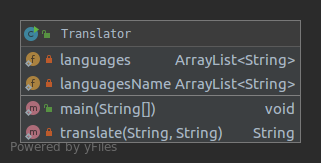

# Testing

We want to program a dictionary to translate a English text into a language of our choice, say Spanish.  This dictionary, in the form of a class, Dictionary, is initialized with a word file and allows us to query the translation of a English word.  The program should allow several translation alternatives

# List of Requirements

The list of requirements are [here](https://github.com/cs2901/testing-ayuda-pe/blob/master/Requirements/Requirements.md).

# Use Cases

The Use Cases and the diagrams are [here](https://github.com/cs2901/testing-ayuda-pe/blob/master/UseCases.md).

# Diagrams 

## Component Diagram:

## Class Diagram:

## Use Case Diagram:

